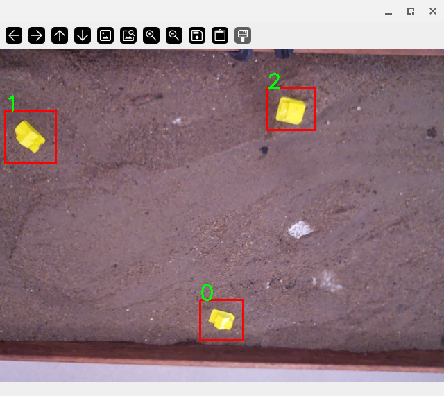
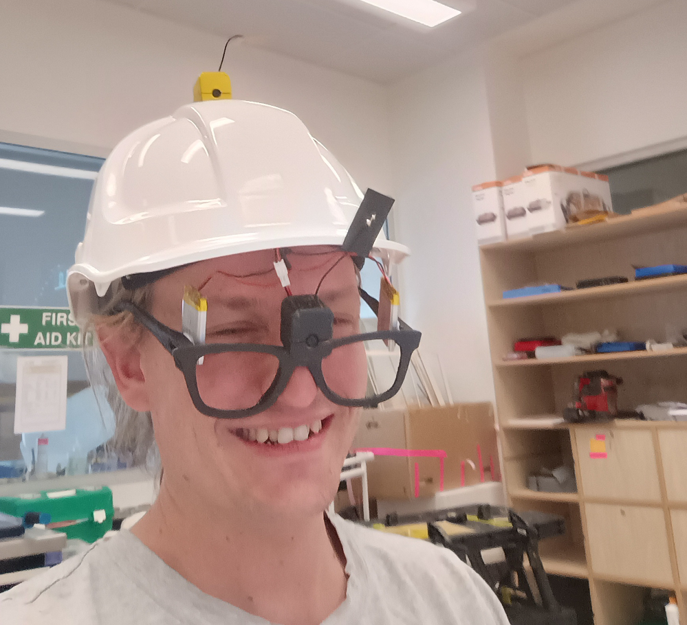
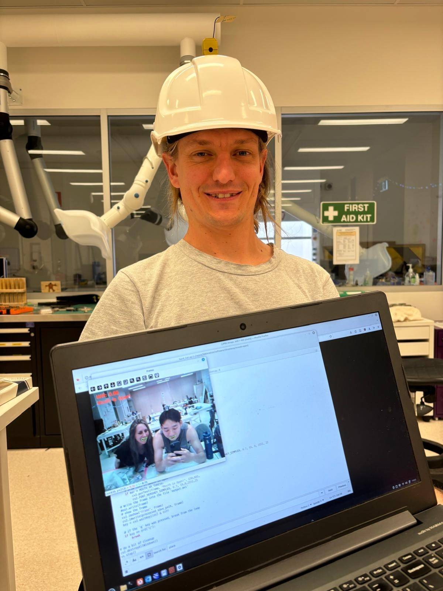

Computer vision was an important part of the Cybernetic Stream Table (CST) project. In thinking of ideas for my CPS project, I heavily favoured projects that involved computer vision as it is increasingly important to the work I do in environmental science. The drone technology that I am hoping to work on in the future is based on computer vision for two separate applications:
1. Photogrammetry makes mathematical models by comparing many images to each other.
2. Remote sensing categorises image data to draw conclusions about the health of plants or ecosystems. It sometimes draws on hyperspectral data to augment the visible light images.

## Objectives
1. **Object Recognition** --- Write some computer vision code to recognise objects in digital photos.
2. **Algoritm Choice** --- Understand the diversity of algorithms grouped as machine vision and a bit of an overview of how each works and what it can be used for.  
3. **Algorithm Development** --- Develop a new computer vision method that could be applied to my work in natural resource management.

## Prior knowledge 
*Very limited* 

I use Open Drone Map (ODM) to make photogrammetric models from my drone photos. ODM draws heavily on python's OpenCV (Open Computer Vision) library. From the logs I've seen that an algorithm called FLANN is used to detect overlap in photos. I've got ideas about how FLANN might work but I have never had occasion to get my hands dirty and try to edit or create OpenCV code. As a a scientist, I feel a strong urge to spend some time mucking around using FLANN to understand its limitations. For other aspects of my scientific practice, I generally understand how the system works and what its limitations are. I'd like to understand my drone's computer vision abilities at least as well as I understand its satellite navigation.

## Progress

### Objective 1 --- Object Recognition

#### March 2024
*No progress*

#### June 2024
*Good progress*

I've written my first computer vision algorithm. The Cybernetic Stream Table had the ability to recognise yellow objects that were placed on the surface of the table. I achieved this by elevating a Raspberry Pi up above the table and pointing the Pi's camera down towards the table. I then wrote image recognition code to run on the Raspberry Pi.



From the outset I knew that it would be best to write a very simple image recognition algorithm. I did some research on the alternatives but decided that, to keep it achievably simple, I would only try to recognise brightly coloured objects. I found the process of writing the code pretty straight forward. I got stuck for a couple of hours trying to define bright yellow in the HSV colour space but, apart from that, the computer vision code took much less time to develop than I had been estimating.

<iframe width="560" height="315" src="https://www.youtube.com/embed/t2YHfOZ1-vY?si=Ju2vy3iAj9-uPXkH" title="YouTube video player" frameborder="0" allow="accelerometer; autoplay; clipboard-write; encrypted-media; gyroscope; picture-in-picture; web-share" referrerpolicy="strict-origin-when-cross-origin" allowfullscreen></iframe>

One interesting learning from developing my own algorithm has been the recognition that most computer vision code runs in `while true` loops. The applications that I have been imagining for computer vision are all one-shot automated analysis but the extant literature is oriented towards sensing the world in real-time. When I started work on the Cybernetic Stream Table I envisaged that the computer vision algorithm would be run once every minute to sense the state of the table and adjust the flow. However, as I learnt about the capabilities of the technology I realised there was no reason not to try to sense and actuate in real time. This, and the fact that even a Raspberry Pi was adequately powerful to do so, has got me thinking about how *real-time* computer vision could be applied in my field.

#### November 2024

*Accomplished*

Focused Hearing, our group CPS build, included a sizable computer vision component. In fact, most of the software that we had to write for Focused Hearing was computer vision and intended to translate video of people's lips into English text. As such, I got quite a significant opportunity to spend more time developing algorithms in Python's OpenCV library. 

I was able to build on the color recognition algorithm that I had written as part of my semester one project and write code for facial recognition, lip recognition, and analysis of facial landmarks, particularly the lips. Most of what I did was, of course, forked from open source repositories, but this has been an invaluable experience towards realization of my object recognition goal. 

A serious challenge that I overcame in development of focused hearing's computer vision was in making the computer vision algorithm live. The sensors were all on board a small Arduino device and the processing was done by my Linux laptop. The laptop also acted as a server, which live-streamed processed video from the Arduino out to any devices that connected over the Wi-Fi. I ran into many errors while establishing this that related to incomplete and corrupted images. 



Interestingly, the web server code had a try statement each time it tried to load a processed image from the computer vision code. This was intended to prevent errors where two different threads are accessing the same file at the exact same time, and it's the type of error that I had never dealt with in my scientific programming. I spent quite a lot of time debugging an error that was derailling this try statement because the way that I'd written the except clause also generated the same error caused by multiple threads accessing the same file at the same time. in the code below, the try and except clause both open a file (`image.jpg`) which is often in the process of being overwritten by the computer vision software that I built. Changing the except statement to show a static test pattern instead of `image.jpg` resolved all the errors. 

```python
def get_image():
    while True:
        try:
            with open("src/image.jpg", "rb") as f:
                image_bytes = f.read()
            image = Image.open(BytesIO(image_bytes))
            img_io = BytesIO()
            image.save(img_io, 'JPEG')
            img_io.seek(0)
            img_bytes = img_io.read()
            yield (b'--frame\r\n'
                   b'Content-Type: image/jpeg\r\n\r\n' + img_bytes + b'\r\n')

        except Exception as e:
            print("encountered an exception: ")
            print(e)

            with open("image.jpg", "rb") as f:
                image_bytes = f.read()
            image = Image.open(BytesIO(image_bytes))
            img_io = BytesIO()
            image.save(img_io, 'JPEG')
            img_io.seek(0)
            img_bytes = img_io.read()
            yield (b'--frame\r\n'
                   b'Content-Type: image/jpeg\r\n\r\n' + img_bytes + b'\r\n')
            continue
```

When I identified object recognition as a skill that I would like to learn, I never imagined that I'd be learning to do computer vision in real time. I'm very satisfied that I've had the opportunity to learn this, as it has been a sort of paradigm shift in the way that I approach programming.

### Objective 2 --- Algorithm Choice

#### March 2024
*Minimal progress*

I haven't yet got around to opening the documentation for OpenCV or searching for resources that will help me learn it. The one insight I've had was when Hannah Feldmann linked us to [Teachable Machine](https://teachablemachine.withgoogle.com/). This easy machine learning platform might be useful for realizing my computer vision aspirations. 

#### June 2024
*Good progress*

As part of the Cybernetic Stream Table project, I spent some time researching different ways to detect objects in images. I mostly focused on the capabilities of the [OpenCV python library](https://opencv.org/). OpenCV distinguishes between feature detection and object recognition. 

Feature detection is for recognising key-points in an image where there is a lot of contrast between neighbouring cells. Algorithms that automatically align or stitch images, such as photogrammetric algorithms, use feature detection. [The OpenCV documentation](https://docs.opencv.org/3.4/db/d27/tutorial_py_table_of_contents_feature2d.html) lists many feature detection algorithms. Amoung them are the SIFT and SURF algorithms that are familiar to me from my work with Open Drone Map. [The FLANN matcher](https://docs.opencv.org/3.4/d5/d6f/tutorial_feature_flann_matcher.html), with which I was also familiar, uses the key-points identified by SIFT and SURF to align images with each other. 

OpenCV has a range of object identification models that are based on key-point identification much like the above. Identification algorithms work by using many binary classifiers (e.g. faces or no faces present) to identify if a particular type of object is present in the image. Algorithms can be  weak classifiers or strong classifiers. The former make many errors but perform better than random chance. The latter can reliably classify images. [Strong classifiers can be made by the layering of many weak classifiers](https://docs.opencv.org/3.4/db/d28/tutorial_cascade_classifier.html). 

Machine learning models are another completely different approach to solving this problem. [Hugging face has a long list](https://huggingface.co/models?pipeline_tag=object-detection&sort=trending) of models that are designed to recognise objects in an image. The vast majority of these models have been trained on everyday objects from the urban and domestic environments but, it seems to me, there is no reason that they couldn't be used to recognise emergent objects in natural environments.

For the Cybernetic Stream Table, I decided to stick to recognising brightly coloured objects as this was the most achievable in the short time frame that I had but the background research before making that decision has given me a fair bit of insight into the application of computer vision. 

#### November 2024

*Good progress*

Though I feel that I still have quite a way to go and a lot to learn in this skill, having practiced computer vision now for two semesters, I do feel that I'm starting to get a feel for what algorithms are available and the pros and cons of different algorithms. 

One interesting learning from working on focused hearing was the realization that pre-trained neural networks are actually pretty easy to implement. In the past, I'd considered this as a sort of step change where conventional deductive algorithms were easy and low on computational resources, whereas the development process for neural networks was much much harder and extremely computationally intensive. This is not the case. The facial recognition algorithm that I used for focused hearing was very very easy to set up. The python code below shows how the dlib library has made face detection and facial coordinate prediction very easy to use. The one difference between this and a conventional algorithm was perhaps just that I had to download a data set of model weights, which was in the order of 20 megabytes in size. Similarly, the algorithm that assigned landmarks to the face was pre-trained and easy to implement. My laptop is not powerful. It's more than 10 years old, but it was able to run these algorithms in real time. 

``` python
# initialize dlib's face detector (HOG-based) and then create
# the facial landmark predictor
print("[INFO] loading facial landmark predictor...")
detector = dlib.get_frontal_face_detector()
predictor = dlib.shape_predictor(args["shape_predictor"])
```

Conversely, I also witnessed my group-mate Izak working on a custom neural network algorithm for the transcription of text from lip reading. This turned out to be a much harder undertaking than I had imagined. So, although I realized that there are neural nets that are quite easy to implement and low on computational resources, I also came to understand how hard it can be to implement a custom neural net, especially when you need to train it yourselfy. I'll need to keep practicing computer vision in the future to develop this skill, but I feel that I've made good progress and I would like to continue.

### Objective 3 --- Algorithm Development

#### March 2024
*No progress*

#### June 2024
*Minimal progress*

The colour recognition algorithm that I created could be used to meaningfully analyse drone images of rivers if you had a hyperspectral camera. This way it would be possible to quickly classify bare ground, water and different types of vegetation. I've read [a paper](https://www.mdpi.com/2072-4292/13/19/3983) that did just that.  I haven't done any work towards that yet but the computer vision work that I did for the Cybernetic Stream Table project has developed some of the skills that I would need to write such code. 

On demo-day I did a lot of talking about how it would be cool to develop algorithms that recognised geomorphic features in a river. This would be a revolutionary tool for river science but it would be made of much more complicated algorithms than just colour recognition. I think that it would also need a significant machine learning component. 

#### November 2024

*Some progress*

My efforts this semester were focused on the Focused Hearing project and as such, I didn't really have any chance to develop algorithms relevant to my field of environmental management. However, I did undertake a  professional placement with a company doing innovative things within my industry. There I actually got the chance to read about some cutting-edge computer vision algorithms that are being applied to solve problems that are directly relevant to my field[^garber].

As part of the professional placement I also spent some time trying to download and run some computer vision programs. I feel that within my own context I'm a pretty skilled programmer, but I wasn't able to get this program running as it required a very fragile development environment, including a specific version of the R programming language and a library in Python that allowed it to execute R code. The learning from this experience was that we are on the cusp of my field adopting quite sophisticated computer vision technologies and that I personally do have the skills to participate in this if I would like to. 

## Final Reflections

I'm very glad that I chose computer vision as a skill for this master's program. Learning computer vision has been a sort of step change in my programming abilities. As alluded to in my reflections on the object recognition skill, computer vision is unlike the programming that I've done in the past, in that there is a while true loop that effectively makes all the code live and interactive. When I nominated to learn this skill, I didn't realize that what I'd really be learning was effectively robotics, making a computer algorithm interact with the world as it changes. I had imagined that I would be learning the skill so that I could process data collected with my drone long after I'd left the field. I've serendipitously developed an understanding of how the drone uses computer vision to navigate its environment, and how live feeds of imagery from the drone could be processed to give real-time insights to human users.

This segues to another of the learnings that I just didn't expect to happen, which is really around just how powerful and fast computers are these days. At some point I realized that my brain is stuck imagining the Pentium 3 or the Celeron 1000 that were the first computers I ever used. Those devices were very much stop start and not live. Even the dial-up internet that they used to connect to would take a minute or so to load up a page of pure text. My work this semester on computer vision has shifted me into a completely different paradigm where the computer's processing of input data is much faster than the human user's capacity to perceive the output. This has opened up the concept of human-computer integration for me.



Coming into this course I bought a $150 Chromebook second-hand off Gumtree, as from my perspective, there was no limit to what a good programmer could do with lightweight hardware. Coming out of the course I've now got a thirst for modern, powerful computing hardware. I think I'm going to invest in a workstation with a big GPU, as I'm now starting to conceive of whole different ways of using my computer.

## References

[^garber]:  Garber, Jonathan, Karen Thompson, Matthew J. Burns, Joshphar Kunapo, Geordie Z. Zhang, and Kathryn Russell. “Artificial Intelligence and Objective-Function Methods Can Identify Bankfull River Channel Extents.” *Water Resources Research* 60, no. 1 (2024): e2023WR035269. <https://doi.org/10.1029/2023WR035269>.

