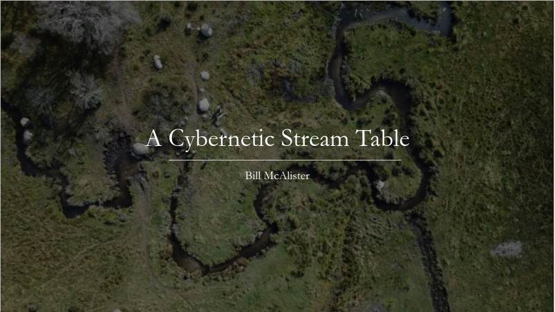
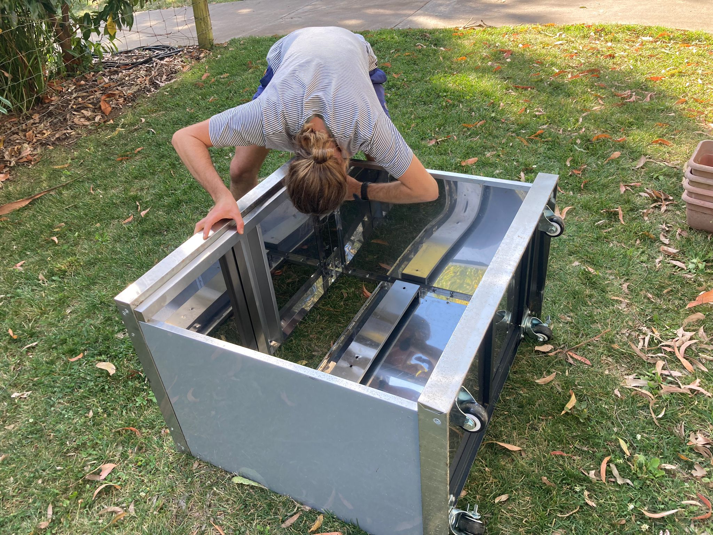

# Introduction
I'm undertaking the Master of Applied Cybernetics at ANU and this website has been created to document my learning as I progress towards Building cyber-physical inventions alone or in interdisciplinary teams. The first invention, that I have undertaken to build alone, is called the cybernetic stream table and you'll see many references to it throughout this site.   

## Skill choices

Please choose from the list below to learn about my journey developing the skills of a cybernetician:

1. [Markdown publishing](markdown-publishing)
2. [Systems thinking](systems-thinking)
3. [Computer vision](computer-vision)
4. [Purposeful interdisciplinary collaboration](purposeful-interdisciplinary-collaboration)

This is a Jekyll website created with markdown. 
