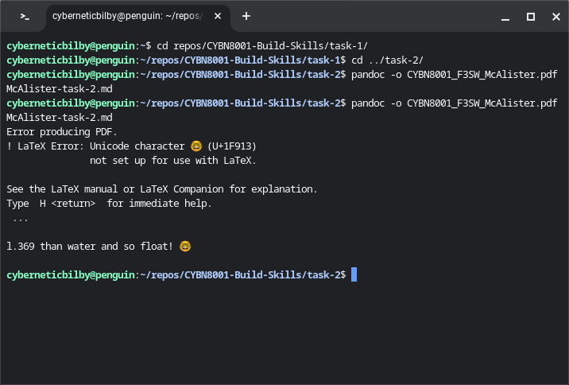
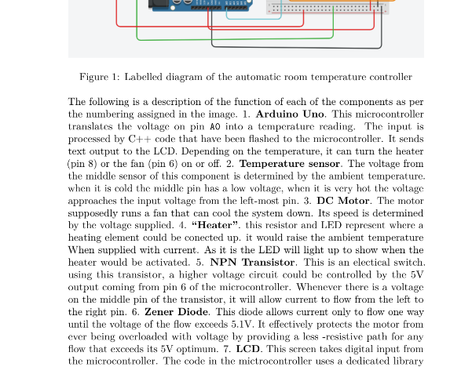

# Markdown publishing
Markdown is a writing format for text files that can be automatically converted to many other formats. I got interested in learning markdown when I learnt about GitHub pages. This service allows you to generate whole websites from your uploaded markdown. Markdown can also be transformed into PDFs and Word documents. Drafting documents in markdown leaves you open to later publish in any format or several at once.

Part of the appeal of using markdown to author content is that it is straight-forward to write scripts that query and edit it.  At a later date, if I decide a that I want to re-publish this website as a PDF, I might need to change the format of the references. Because it is markdown, I'll be able to write simple code to process the raw md files and make the necessary changes to the reference format. I can also throw all the markdown that I have ever written into a big folder and then use tools like grep to find all mentions, for example, of the term 'systems thinking'. 

Markdown can also be integrated with GNU transparency tools such as [git](https://git-scm.com/) and [make](https://www.gnu.org/software/make/). This way, the full process of authoring the document is open for anyone to see or replicate. I think this creates fascinating data especially for documents that are be maintained over a long time or remixed. In sum, I think markdown is the best way of encoding text for future knowledge systems and that learning to do it well will open up possibilities for me and just generally make the world a better place. 
 
## Objectives
1. Identify software and establish workflows for doing as much of my writing as possible in markdown and versioning it with git.
3. Author complicated documents in markdown that include academic citations, footnotes, internal references, figure captions etc. 
4. Be able to apply and customise Jekyll templates to design markdown based websites.

## Prior knowledge
**Limited.**

Before starting this course, I had an app on my phone to write notes in markdown so I've been taking all my personal notes in markdown for a few years. I had also published a very small amount of markdown as readmes for my major coding projects.  Below is the most sophisticated markdown I had written before starting the course. The [file can be found on my GitHub profile](https://github.com/bill-mca/geotag-leaflet/blob/main/README.md).
```
# geotag-leaflet

The purpose of this code is to allow me to quickly generate a map of a landscape following a site visit. I intend to be able to download photos from my phone and drone and use this tool to create a leaflet map in 10 minutes. these webmaps could be deployed to my website by another script for a rapid turnaround on a site assessment.

## Attribution
This is largely adapted from code writen by Jayson DeLancey and available in [this tutorial](https://developer.here.com/blog/getting-started-with-geocoding-exif-image-metadata-in-python3).

## Instructions
geojson_from_exif.py is a script that takes a path to a directory as input and outputs a geojson of all the geotagged jpegs in that folder to the stdout.

generate_thumbnails.py makes a copy of a directory with all jpegs shrunk to thumbnails.

webmap_from_photos.sh takes a path to a directory full of geotagged photos and will generate thumbnails and a json layer compatible with the included index.html template.
```
I'd never used pandoc before and I'd always used Microsoft Word to author documents. Apart from some brief attempts at writing HTML, I've only ever used integrated content management systems to publish websites. I did have a go at using Jekyll once but didn't get very far. The presentation of this webpage represents the limits of my Jekyll capabilities.

## Progress

### Objective 1 - Workflow
**Significant progress**

I've done a lot of writing in markdown since starting this course including [two skills work assessments](https://github.com/bill-mca/CYBN8001-Build-Skills/) and [this webpage](https://github.com/bill-mca/bill-mca.github.io)! I've experimented with a few markdown editors and decided that it doesn't really matter which one you use because markdown is so simplistic. My biggest success has been demystifying git by learning to use [Gitfiend](https://gitfiend.com/). 

I'm not comfortable that this objective has been reached. Once I've authored a few large documents I'll feel confident in the workflow that I've established.

### Objective 2 - Publishing documents
**Some progress amid frustrations.**

I have made PDF versions of my two skills work assignments but the process was not smooth for either of them. For skills work assignment 2 I resorted to making the PDF via some edits on a docx version because I was worried I wouldnt be able to debug the pandoc errors in time for submission!



I've had frustrating errors thrown at me by pandoc. Here's a list of the issues I encountered while trying to PDF Build Skills 2: 
1. The default margins are much too big
2. Some of the figures are given captions but some are not
3. Some of the ordered lists are not recognized as such and so drawn as big ugly blocks of text
4. Some hashes (##) were randomly inserted in the document
5. Heading sizes are hard to tell apart and the navigation pane of the PDF reader didn't show the expected hierarchy



I've struggled with adding references to markdown docs and had to use a workaround where zotero outputs an HTML bibliography that I have to process with pandoc before manually appending to the markdown document.

So far, I would've been better off using familiar tools such as Microsoft Word to do these assignments. The effort involved in proofing and debugging the pandoc outputs has been substantial. nevertheless, I'm hopeful that, as my markdown familiarity and my authoring workflows improve, the whole process will get a lot smoother and I'll have a powerful new tool for publishing my work across formats. 

### Objective 3 - Publishing websites
**Starting out.**

This website represents my first serious attempt at publishing a markdown-based website. I feel that it is functional but I haven't even started on trying to design something appealing. Also, as it is, the medium has been limiting me somewhat. I've held back on adding some content because of a feeling that it would be too much hassle to pull off. I haven't been able to do references for this site properly. All the references have had to go on a separate page rather than being placed near where they are on the site. This was mostly due to time constraints but I anticipate referencing to be one of the major challenges in mastering this markdown skill.