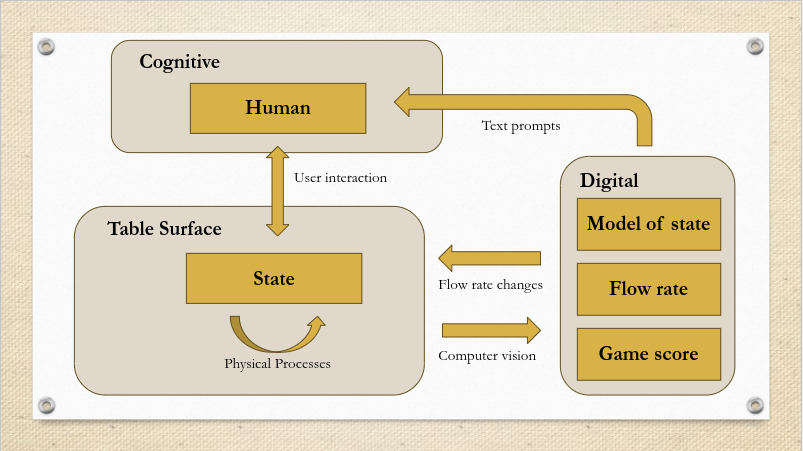

According to Donella Meadows, a system is:

>... an interconnected set of elements that is coherently organized in a way that achieves something. … a system must consist of three kinds of things: elements, interconnections and a function or purpose.

## Objectives 
1. **Systems Thinking for Design** --- Apply systems thinking to the design of CPS
2. **Communicating about Systems** --- Effectively communicate about systems with diverse audiences
3. **Futuring with CPS** --- Use CPS as boundary objects to facilitate constructive discussion about the future of environmental systems

## Prior knowledge 
My background is in natural resource management (NRM). Systems thinking is widely recognized as an important part of NRM however, it is rarely delineated to which issues the systems lens must be applied. Moreover, despite my 5 years experience working in NRM, I couldn't say with confidence exactly what systems thinking was. I believe that, like most NRM practitioners, I was developing an ad-hoc systems thinking skill set but lacked the ability to abstract my systems thinking from the problems that i applied it to.

In preparation for this course I read *Systems Thinking - A Primer* by Donella Meadows (2008).

## Progress
### Objective 1 - Systems thinking for design

#### March 2024
*Some progress*

As part of my preparation for the resource facilitation assignment, I read the book chapter *Designerly Ways of Knowing: What Does Design Have to Offer?* (Hocking 2010). Earlier, I had written a note about my goals for the build journey and, under the heading 'Systems analysis' I'd stated that my goal was "Properly describing systems and identifying where the leverage points are so that my work is purposeful and strategic". I've changed the boundary that I put around this skill and now see it as a way of relating and effecting change in the world. This is reflected in the updated objectives as stated above. My theory of change has shifted to be more about the conversations that the cybernetic stream table will provoke rather than building a CPS that will change the world. 

Below is an image that I presented as part of the maker project pitch assignment. It shows my conceptualisation of a stream table as an information system with feedbacks. It also shows how I intend to augment that system by adding an extra feedback loop so that the state of the table influences the flow rate of water via a digital system. On the day I tried to explain (see objective 2, below) that the extra layers of feedback make the cybernetic stream table a better model of human interaction with the environment than a conventional stream table.

Since presenting the pitch, I've had some thoughts about better ways of conceiving of this model. The feedback, and the nature of the feedback should be more explicitly stated as part of the model. Furthermore, I could draw up a system model of how a river works with human interaction. I could then draw parallels between the structure of the real-life information system and my simulation of it. I'm finding these highly abstract concepts of systems very difficult to grapple with but I'm enjoying the challenge for now.

#### June 2024
*Good progress*

During an in-class exercise about networks we were asked to map out a network related to our build project. I chose to map out the components of the Cybernetic Stream Table and to 

I believe that the diagram shows that my thinking about the design of the project had become clearer. There is less detail about the workings of the CST but there is a clearer explanantion of the meaning of the CST project. For the CST to work as an educational device the message about how it works and why had to be quite clear. I believe that, as the project progressed, my emphasis on the simplicity of the design and the clarity of the messaging grew.  

I think I was influenced by existing commercial stream table designs to choose a stainless steel tray as the basis of the CST. The stainless steel tray has a lot of adventages if you are commercially manufacturing the device for sale. It is more durable and sheet stainless steel is a standard commodity, so you can standardise the outputs that you produce. However, my CST was not designed to be commercially manufactured. It was designed to be replicated by enthusiasts. for this purpose stainless steel sheet metal is very impractical. There were significant delays in my project timeline while I worked out how to properly drill holes in the stainless steel and that's despite the fact that I was lucky to find a ready-assembled tray for free on the side of the road. To make an easily replicable design it was clear that the stainless steel tray was not viable.

In-class exercises about affordances also contributed to the way that I designed the CST. I did a lot of thinking about how to encourage people to play with the table. I knew from my previous experience of using stream tables that children love playing with them but adults are usually hesitant. The above image of the early CST design shows that I had originally thought of using plastic as the medium instead of river sand. Plastic has the advantage of being less dense than sand and so can be transported by lower energy flows. For this reason, many commercially available stream tables use plastics for the medium. However, thinking from a systems perspective, demonstrating  dynamic geomorphic behaviour was less important than getting people engaged in fiddling with the device and, I reasoned, natural sand looked a lot more inviting than brightly coloured, greasy plastic. I'm glad I made the decision, I think that the use of river sand removed one extra abstraction from the design and so made the device more intuitive and explicable for demo-day. That's not to say that it would be impossible to improve the CST with a plastic medium, only that, with the short timeframe that I had, using sand was an easy way to make the device understandable, appealing and functional.

#### November 2024
*Goal shifted*

I've made some progress towards using systems thinking to design cyber-physical systems. On reflection, this semester my thinking has become increasingly pragmatic about this skill. I believe that when I decided to include this skill in my build journey, I imagined mapping out systems so that they could be understood in advance and that this would inform good design deisions. My thinking has evolved so that now the design is made and prototyped and systems thinking skills are used to fully assimilate the feedback that results from deploying or testing the system in interaction with its wider context. This is akin to the fail fast and iterate approach that characterizes Silicon Valley projects. 

I believe that I have come to this perspective as a result of some of the learnings on the cybernetic stream table and perhaps a general retreat from positivist ideas. In effect, the thing that you're building is complex. The social world that you'll be deploying it into is extremely complex. Effective design does not consist in predicting the best way to achieve an outcome, but in iteratively correcting your trajectory towards the desired outcome by being open to understanding all the ways hat things can go off course or have unintended consequences.

### Objective 2 - Communicating about Systems

#### March 2024
*Starting out*

As part of the pitch of my maker project, I was expected to highlight '...new ideas or thoughts ... relevant to applied cybernetics'.  I tried really hard to get across my ideas about how an extra layer of feedback will change the meaning of the stream table but I felt that I didn't get the message across. I'm looking forward to honing this as the program progresses. I believe that the first demo day will be an excellent opportunity to hone my ability to coherently communicate about systems.

#### June 2024
*Some progress*

I was setting up the CST on demo-day when I had the thought "what does this mean again?" Thankfully the first 5 or 6 people who approached me on demo-day were all friends and family. They helped me to recollect the idea of the CST as an imperfect allegory for how humans manage environmental systems. Nevertheless, I felt quite manic for the whole day and I didn't feel confident that I was getting the message across about the systemic meaning of the project. 

One thing that I'll do differently in the future is try to be less didactic when using a project like the CST. In hindsight I feel that I treated each interaction something like an oral exam where people were testing me to see if I understood what I'd created. That was silly. I also spent a lot of time talking about the details of how the thing worked rather than what impact it would have if the project were pursued and properly developed. These frustrations aside, demo-day was valuable experience even if all I learned was what not to do. 

#### November 2024
*Good Progress*

I'm not yet 100% confident about my ability to communicate about systems. During the professional placement that I undertook as part of the Masters of Applied Cybernetics, someone asked me what the benefit is of adopting a systemic perspective and I was truly stumped. I couldn't even point to an example of what a system might be within my own field. I could choose to excuse this as just a one-off mistake, but I also believe that there is something fundamental that the concept of a system, being as it is abstract and intangible, will often escape the grasp even of a very practiced cybernetician. 

One thought that I have had since, that I feel will improve my ability to communicate about systems, is that there is a spectrum of systems ontologies. On the one hand, systems dynamics, and perhaps biological systems theory, reify systems as real objects of study - self-perpetuating patterns of information. Other systems methodologies, such as soft systems methods, treat the system as more of a convention that allows us to have better conversations about what's really going on. From now on, whatever context I'm in, I'll try to keep in mind both types of systems thinking. When communicating with natural scientists, I believe that the hard systems methodologies will cut through better. But when talking to people from other fields, it might be better for me to deploy the soft systems ideas to have a conversation with them about where the boundaries of their field constrain them. Systems as a convention can then be put forward as a way to transcend those limitations to some extent. 

Ideation has always been easier for me than communication. I'm still often stumped when people ask me what cybernetics is and can't think of a way to make it real to them. I think I've at least moved beyond describing it as the study of circular causality - which got me nowhere. When I've got time to deliver more than just an elevator pitch, I feel confident that systems mapping through conversation will allow me to get the idea across to people. But I do have a long way to go with this skill and I hope that further readings help me to keep improving.

### Objective 3 - Futuring with CPS

#### March 2024
*No progress*

#### June 2024
*Starting out*

I haven't yet had a chance to practice this skill. Conversations about the CST on demo-day never reached this level of complexity. I have, however, had a good chance to look into the theory of this skill. As part of the problematique assignment I read about the maker movement and critical making. Critical making aims to open people's mind to different ways of relating to technology by allowing them to make different versions of it (Ratto, 2011). A simple example would be constructing different types of networks (centralised, decentralised and distributed) and playing with the social consequences of different network architectures.

#### November 2024

Focused hearing did give me the opportunity to talk about possible futures that might result from technologies. One really cool aspect of focused hearing was that, for some people at least, it raised a lot of questions about ubiquitous surveillance and how we should make decisions about whether that's okay. I had a few really good conversations on demo day about how this surveillance technology is coming, and how it might change our social worlds, the workplace, for example. 

I've found it rewarding to be able to produce quite impressive prototypes using my computer vision skills. People's faces did light up when I'd show them a small, custom-made device that can detect and map their lips in real time. I have had, through demo day, the experience of how an impressive prototype helps to create a space where people are excited to have conversations that might otherwise be uncomfortable. I believe that having a prototype to show people and the ability to talk about what was involved in making it was the wedge that opened up discussion about potential negative consequences that might result. I felt that if I were just standing in front of a powerpoint presentation about ubiquitous surveillance, I would not have had the same conversations. 

I do feel that I've advanced in this skill and I'm excited to keep on practicing it once I return to the workforce. One reservation I have, however, is that I might not have the opportunity in future to be creative and to make the types of prototype that spark conversations about the future. I need to consider how important it is to me to have that creative outlet in my work.

## Final Reflections

Perhaps as recently as two years ago, I was eager to work on high-fidelity computer models that would predict the outcome of environmental management interventions. As I started to study the computer models that are used to make environmental decisions and learned of their limitations, my perspective completely changed. Something similar has happened with systems thinking. Coming into the Master of Applied Cybernetics, I imagined that I would be able to learn to map systems and make meaningful predictions about how my actions would change systems. 

Mapping systems is certainly not a futile exercise and it does yield valuable insights, however, my understanding of systems thinking has shifted to emphasise a reflective practice. Instead of perfect knowledge in advance, one must interact with the system from a position of incomplete understanding. System's thinking skill is in opening oneself to many possible perspectives in order to receive feedback about how the system really works and what your impacts are. I'm glad to be having these reflections and that I elected to focus on systems thinking as one of my build skills. I still feel that I have a lot to learn about this discipline.

## References 

Hocking, TV, 2010, 'Designerly Ways of Knowing: What Does Design Have to Offer?', in *Tackling Wicked Problems*, Routledge.

Meadows, D, 2008, *Thinking in Systems: A Primer*, ed. D. Wright, Illustrated edition, Chelsea Green Publishing Co, White River Junction, Vt.

Ratto M (2011) 'Critical Making: Conceptual and Material Studies in Technology and Social Life', *The Information Society*, 27(4):252--260, doi:[10.1080/01972243.2011.583819](https://doi.org/10.1080/01972243.2011.583819)

